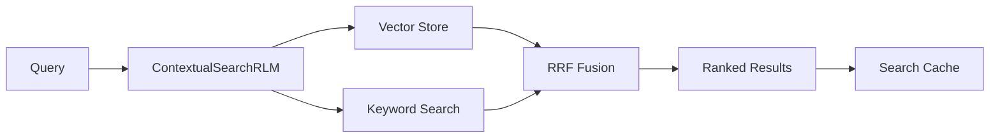
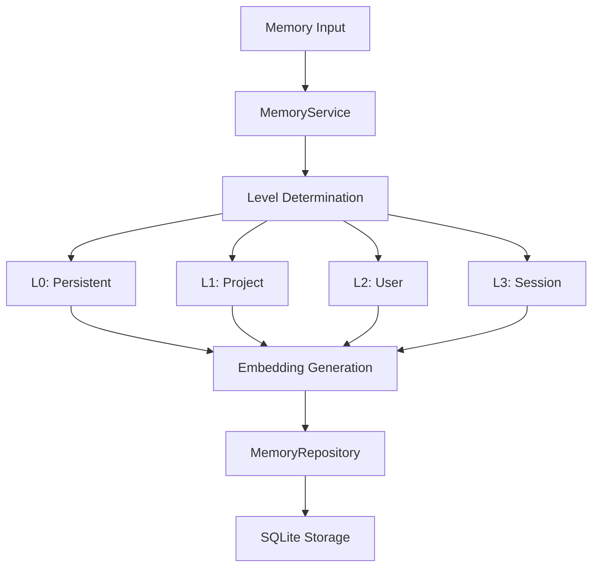

## Overview

th0th is built on a **4-layer architecture** that separates concerns and enables protocol-agnostic integration. The core business logic is independent of transport protocols (MCP, HTTP), making it easy to extend and maintain.

```
th0th/
├── apps/
│   ├── mcp-client/           # MCP Server (stdio)
│   ├── tools-api/            # REST API (port 3333)
│   └── opencode-plugin/      # OpenCode plugin
├── packages/
│   ├── core/                 # Business logic, search, embeddings, compression
│   └── shared/               # Shared types & utilities
```

## Core Layers

The `@th0th-ai/core` package implements a clean 4-layer architecture:

<CardGroup cols={2}>
  <Card title="Tools Layer" icon="screwdriver-wrench">
    Thin MCP handlers with schema validation and delegation to controllers
  </Card>
  <Card title="Controllers Layer" icon="gears">
    Orchestration logic that composes services and manages side effects
  </Card>
  <Card title="Services Layer" icon="brain">
    Domain logic for scoring, embedding, graph analysis, and compression
  </Card>
  <Card title="Data Layer" icon="database">
    Persistence with SQLite, FTS5, and migrations
  </Card>
</CardGroup>

### Layer Responsibilities

**1. Tools Layer** (`packages/core/src/tools/`)
- Schema definition and validation
- Protocol-specific request/response handling
- Thin delegation to controllers
- No business logic

**2. Controllers Layer** (`packages/core/src/controllers/`)
- Composes multiple services
- Manages side effects (logging, metrics)
- Transaction coordination
- Error handling and recovery

**3. Services Layer** (`packages/core/src/services/`)
- Pure domain logic
- Search algorithms (vector + keyword)
- Compression strategies
- Memory ranking and scoring
- No I/O dependencies

**4. Data Layer** (`packages/core/src/data/`)
- SQLite persistence
- Vector and keyword indexing
- Schema migrations
- Query optimization

<Note>
This layered architecture allows th0th to support multiple protocols (MCP, HTTP, CLI) without duplicating business logic. The core package is protocol-agnostic.
</Note>

## Component Architecture

### Semantic Search



The search system uses **hybrid retrieval**:
- **Vector search**: Semantic similarity via embeddings (SQLite)
- **Keyword search**: BM25/FTS5 for exact matches
- **RRF fusion**: Reciprocal Rank Fusion with k=60 for optimal ranking
- **Multi-level cache**: L1 (memory) + L2 (SQLite) for 50%+ cache hit rate

### Compression Pipeline


The compression system uses **structure-preserving** strategies:
- Extracts imports, interfaces, classes, functions
- Keeps signatures and type definitions
- Removes implementation details
- Maintains code hierarchy and relationships

### Memory System



Memories are organized in a **hierarchical level system**:
- **L0 (Persistent)**: Cross-session decisions and patterns
- **L1 (Project)**: Project-specific code and architecture
- **L2 (User)**: User preferences and settings
- **L3 (Session)**: Conversation context (temporary)

## Data Flow

### Indexing Flow

<Steps>
  <Step title="File Discovery">
    Smart chunker scans project directory, respects `.gitignore`, filters by allowed extensions
  </Step>
  <Step title="Smart Chunking">
    Language-aware splitting:
    - **Markdown**: By headings with hierarchy
    - **JSON/YAML**: By top-level keys
    - **Code**: By functions/classes with comments
  </Step>
  <Step title="Parallel Processing">
    Batch embedding generation (8 chunks per batch to avoid Ollama overload)
  </Step>
  <Step title="Dual Indexing">
    Parallel insertion into:
    - Vector store (embeddings + metadata)
    - Keyword search (FTS5 index)
  </Step>
  <Step title="Metadata Tracking">
    Store index metadata for staleness detection
  </Step>
</Steps>

### Search Flow

<Steps>
  <Step title="Cache Lookup">
    Check L1 (memory) then L2 (SQLite) cache for existing results
  </Step>
  <Step title="Parallel Retrieval">
    If cache miss:
    - Vector search (semantic similarity)
    - Keyword search (BM25 scoring)
    Both run in parallel for speed
  </Step>
  <Step title="RRF Fusion">
    Combine results using Reciprocal Rank Fusion with intelligent boosting for code queries
  </Step>
  <Step title="Filtering & Ranking">
    Apply file pattern filters, minimum score threshold, and result limits
  </Step>
  <Step title="Cache Update">
    Store results in both cache levels for future queries
  </Step>
</Steps>

## Storage Architecture

### SQLite as the Foundation

th0th uses **SQLite exclusively** for all persistence:

<Accordion title="Vector Documents Table">
```sql
CREATE TABLE vector_documents (
  id TEXT PRIMARY KEY,
  project_id TEXT NOT NULL,
  content TEXT NOT NULL,
  metadata TEXT,              -- JSON blob
  embedding BLOB,             -- Float32Array
  created_at INTEGER NOT NULL,
  updated_at INTEGER NOT NULL
);

-- Critical indexes for performance
CREATE INDEX idx_vector_project_id ON vector_documents(project_id);
CREATE INDEX idx_vector_project_file ON vector_documents(
  project_id, 
  json_extract(metadata, '$.filePath')
);
```
</Accordion>

<Accordion title="Keyword Search (FTS5)">
```sql
CREATE VIRTUAL TABLE keyword_search USING fts5(
  id UNINDEXED,
  content,
  metadata UNINDEXED,
  tokenize = 'porter unicode61'
);
```
</Accordion>

<Accordion title="Search Cache Table">
```sql
CREATE TABLE search_cache (
  key TEXT PRIMARY KEY,           -- SHA256 hash
  query TEXT NOT NULL,
  project_id TEXT NOT NULL,
  results TEXT NOT NULL,          -- JSON array
  options TEXT NOT NULL,
  created_at INTEGER NOT NULL,
  access_count INTEGER DEFAULT 1,
  last_accessed INTEGER NOT NULL
);
```
</Accordion>

<Accordion title="Memory Repository">
```sql
CREATE TABLE memories (
  id TEXT PRIMARY KEY,
  content TEXT NOT NULL,
  type TEXT NOT NULL,            -- decision, pattern, code, etc.
  level TEXT NOT NULL,           -- L0, L1, L2, L3
  user_id TEXT,
  session_id TEXT,
  project_id TEXT,
  agent_id TEXT,
  importance REAL DEFAULT 0.5,
  embedding BLOB,                -- Float32Array
  tags TEXT,                     -- JSON array
  created_at INTEGER NOT NULL,
  access_count INTEGER DEFAULT 0,
  last_accessed INTEGER
);
```
</Accordion>

<Info>
**Why SQLite?** It provides FTS5 for keyword search, JSON support for flexible metadata, BLOB storage for embeddings, and excellent performance for local-first applications.
</Info>

## Embedding Strategy

### Provider Flexibility

th0th supports multiple embedding providers through a unified interface:

| Provider | Model | Dimensions | Cost | Speed |
|----------|-------|------------|------|-------|
| **Ollama** (default) | nomic-embed-text | 768 | Free | Fast (local) |
| **Ollama** | bge-m3 | 1024 | Free | Fast (local) |
| **Mistral** | mistral-embed | 1024 | \$\$ | API |
| **OpenAI** | text-embedding-3-small | 1536 | \$\$ | API |

<Tip>
Ollama is the recommended default for 100% offline operation with good quality. Use Mistral or OpenAI for production deployments requiring the highest accuracy.
</Tip>

### Batching Strategy

To prevent Ollama crashes on large files, th0th uses **sub-batching**:

```typescript
// Sub-batch size: max texts per embedBatch() call
const EMBED_SUB_BATCH_SIZE = 8;

// Process documents in small batches
for (let i = 0; i < documents.length; i += EMBED_SUB_BATCH_SIZE) {
  const batch = documents.slice(i, i + EMBED_SUB_BATCH_SIZE);
  const embeddings = await embeddingService.embedBatch(texts);
  // Insert with transaction for consistency
}
```

This prevents 500 errors when indexing large markdown files with 50+ chunks.

## Performance Characteristics

<CardGroup cols={2}>
  <Card title="Indexing" icon="bolt">
    **10 files/second** with batched embedding and parallel FTS5 insertion
  </Card>
  <Card title="Search (cached)" icon="rocket">
    **< 5ms** for L1 cache hits, **< 20ms** for L2 cache hits
  </Card>
  <Card title="Search (cold)" icon="gauge">
    **50-200ms** depending on index size and result count
  </Card>
  <Card title="Compression" icon="compress">
    **70-98% token reduction** with structure preservation
  </Card>
</CardGroup>

## Scalability

### Project Isolation

Each project is namespaced by `projectId`:
- Vector documents tagged with `project_id`
- Keyword search uses metadata filtering
- Cache entries scoped per project
- Memories can be project-level (L1)

<Warning>
th0th is optimized for **medium-sized codebases** (< 100K files). For very large monorepos, consider splitting into multiple projects.
</Warning>

### Incremental Reindexing

The `IndexManager` tracks file metadata to enable **incremental updates**:

```typescript
// Only reindex modified files
const filesToReindex = await indexManager.getFilesToReindex(
  projectId,
  projectPath
);

// Smart reindexing strategy
if (filesToReindex.length > 100) {
  // Full reindex if too many changes
  await contextualSearch.indexProject(projectPath, projectId);
} else {
  // Incremental reindex
  for (const file of filesToReindex) {
    await indexFile(file, projectId, projectPath);
  }
}
```

This avoids expensive full reindexing on every search.

## Extension Points

### Custom Compressors

Implement `ICompressor` interface:

```typescript
interface ICompressor {
  compress(content: string, strategy?: CompressionStrategy): Promise<CompressedContent>;
  decompress(compressed: CompressedContent): Promise<string>;
  estimateCompression(content: string): Promise<number>;
  getStrategy(): CompressionStrategy;
}
```

### Custom Vector Stores

Implement `IVectorStore` interface to swap SQLite for ChromaDB, Pinecone, etc.:

```typescript
interface IVectorStore {
  addDocument(id: string, content: string, metadata?: Record<string, unknown>): Promise<void>;
  addDocuments(documents: VectorDocument[]): Promise<void>;
  search(query: string, limit: number, projectId?: string): Promise<SearchResult[]>;
  deleteByProject(projectId: string): Promise<number>;
  getStats(projectId: string): Promise<{ totalDocuments: number; totalSize: number }>;
}
```

## Related Topics

<CardGroup cols={2}>
  <Card title="Semantic Search" icon="magnifying-glass" href="/concepts/semantic-search">
    Deep dive into hybrid search and RRF fusion
  </Card>
  <Card title="Compression" icon="compress" href="/concepts/compression">
    Structure-preserving code compression strategies
  </Card>
  <Card title="Memory System" icon="brain" href="/concepts/memory">
    Hierarchical memory levels and ranking
  </Card>
  <Card title="Deployment" icon="code" href="/operations/deployment">
    Contributing and extending th0th
  </Card>
</CardGroup>