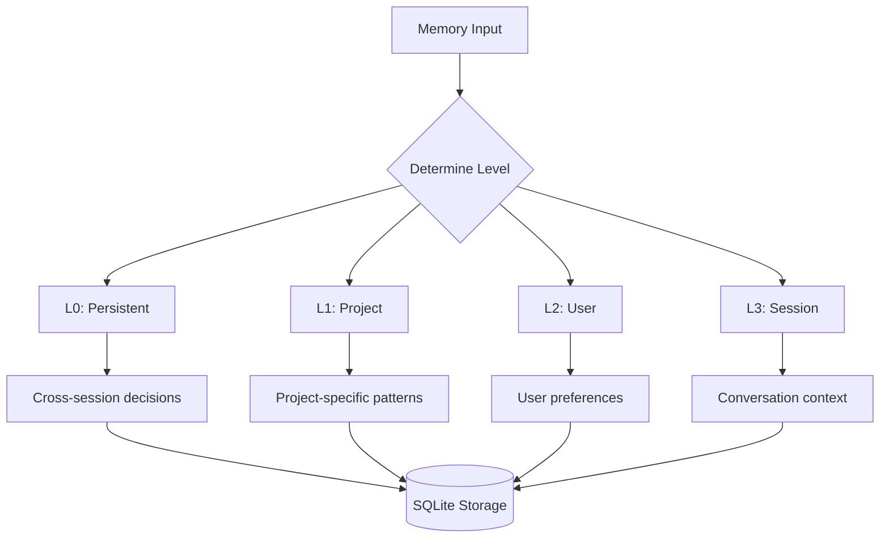

## Overview

th0th's memory system enables AI assistants to **remember context across sessions**. Unlike conversation history that's lost when the session ends, memories persist indefinitely and are retrieved based on semantic similarity and relevance.

<Info>
Memories are organized in **4 hierarchical levels** (L0-L3) with different scopes and retention policies, inspired by human memory systems.
</Info>

## Memory Hierarchy

### Four-Level Architecture



<Tabs>
  <Tab title="L0: Persistent">
    **Scope**: Global across all projects and sessions
    
    **Lifetime**: Indefinite (never auto-deleted)
    
    **Use cases**:
    - Critical architectural decisions
    - Reusable design patterns
    - Important learnings from past projects
    
    **Example**:
    ```typescript
    await th0th.remember({
      content: "Always use bcrypt with cost factor 12 for password hashing",
      type: MemoryType.DECISION,
      level: MemoryLevel.PERSISTENT
    });
    ```
  </Tab>
  
  <Tab title="L1: Project">
    **Scope**: Specific to a single project/codebase
    
    **Lifetime**: Tied to project (deleted when project is removed)
    
    **Use cases**:
    - Project architecture decisions
    - Code patterns used in this project
    - Important file locations and structure
    
    **Example**:
    ```typescript
    await th0th.remember({
      content: "Auth logic is in src/services/auth/, uses JWT with 7-day expiry",
      type: MemoryType.CODE,
      level: MemoryLevel.PROJECT,
      projectId: "my-app"
    });
    ```
  </Tab>
  
  <Tab title="L2: User">
    **Scope**: Per-user across all projects
    
    **Lifetime**: Permanent (user-level preferences)
    
    **Use cases**:
    - Code style preferences
    - Tool configuration
    - Personal workflow patterns
    
    **Example**:
    ```typescript
    await th0th.remember({
      content: "Prefer functional components with hooks over class components",
      type: MemoryType.PREFERENCE,
      level: MemoryLevel.USER,
      userId: "user123"
    });
    ```
  </Tab>
  
  <Tab title="L3: Session">
    **Scope**: Current conversation only
    
    **Lifetime**: Until session ends
    
    **Use cases**:
    - Recent conversation context
    - Temporary decisions for current task
    - Work-in-progress state
    
    **Example**:
    ```typescript
    await th0th.remember({
      content: "User is refactoring authentication to use OAuth2",
      type: MemoryType.CONVERSATION,
      level: MemoryLevel.SESSION,
      sessionId: "session-abc"
    });
    ```
  </Tab>
</Tabs>

### Level Determination

The `MemoryService` automatically determines the appropriate level:

```typescript
function determineLevel(
  type: MemoryType,
  opts: { userId?, sessionId?, projectId?, agentId? }
): MemoryLevel {
  // Agent hierarchy overrides
  if (agentId === 'orchestrator' && type === 'decision') {
    return MemoryLevel.PERSISTENT;  // L0
  }
  if (agentId === 'architect' && type === 'pattern') {
    return MemoryLevel.PROJECT;     // L1
  }
  
  // Scope-based defaults
  if (projectId) return MemoryLevel.PROJECT;
  if (userId && !sessionId) return MemoryLevel.USER;
  if (sessionId) return MemoryLevel.SESSION;
  
  // Type-based defaults
  switch (type) {
    case MemoryType.DECISION: return MemoryLevel.PERSISTENT;
    case MemoryType.PATTERN: return MemoryLevel.PROJECT;
    case MemoryType.PREFERENCE: return MemoryLevel.USER;
    default: return MemoryLevel.SESSION;
  }
}
```

<Tip>
You rarely need to specify level manually—the system infers it from context (projectId, userId, sessionId) and memory type.
</Tip>

## Memory Types

th0th supports 5 memory types optimized for different content:

<CardGroup cols={2}>
  <Card title="DECISION" icon="gavel">
    **Important choices** made during development
    
    Examples:
    - "Use PostgreSQL over MongoDB"
    - "Implement rate limiting at API gateway"
  </Card>
  
  <Card title="PATTERN" icon="diagram-project">
    **Reusable code patterns** and architecture
    
    Examples:
    - "Use factory pattern for creating clients"
    - "Repository pattern for data access"
  </Card>
  
  <Card title="CODE" icon="code">
    **Code snippets** and implementation details
    
    Examples:
    - "Error handling wrapper function location"
    - "Custom hooks in src/hooks/"
  </Card>
  
  <Card title="PREFERENCE" icon="sliders">
    **User/team preferences** and style
    
    Examples:
    - "Use Tailwind over CSS modules"
    - "Prefer async/await over promises"
  </Card>
  
  <Card title="CONVERSATION" icon="comments">
    **Dialogue context** (usually L3/session)
    
    Examples:
    - "User is debugging login flow"
    - "Working on feature: dark mode"
  </Card>
</CardGroup>

## Semantic Retrieval

### Intelligent Ranking Algorithm

Memory recall uses a **multi-factor scoring** system balancing stability and plasticity:

```typescript
function semanticRank(
  memories: Memory[],
  queryEmbedding: number[],
  limit: number
): ScoredMemory[] {
  return memories.map(memory => {
    // 1. Semantic similarity (65% weight)
    const semanticScore = cosineSimilarity(
      queryEmbedding,
      memory.embedding
    );
    
    // 2. Temporal score (20% weight)
    const temporalScore = forgettingCurve(memory);
    
    // 3. Access frequency (10% weight)
    const accessBoost = log1p(memory.accessCount) / log(20);
    
    // 4. Memory type boost (5% weight)
    const typeBoost = getTypeBoost(memory.type);
    
    // Weighted combination
    const score = 
      semanticScore * 0.65 +
      temporalScore * 0.20 +
      accessBoost * 0.10 +
      typeBoost * 0.05;
    
    return { ...memory, score };
  })
  .sort((a, b) => b.score - a.score)
  .slice(0, limit);
}
```

<Accordion title="Semantic Similarity (65%)">
**Cosine similarity** between query embedding and memory embedding.

Measures how closely the query relates to the stored memory conceptually.

```typescript
function cosineSimilarity(a: number[], b: number[]): number {
  let dot = 0, normA = 0, normB = 0;
  for (let i = 0; i < a.length; i++) {
    dot += a[i] * b[i];
    normA += a[i] * a[i];
    normB += b[i] * b[i];
  }
  return dot / (Math.sqrt(normA) * Math.sqrt(normB));
}
```
</Accordion>

<Accordion title="Temporal Decay (20%)">
**Ebbinghaus forgetting curve** with 72-hour half-life.

Memories fade over time unless accessed (which resets their `lastAccessed` timestamp).

```typescript
function forgettingCurve(memory: Memory): number {
  const now = Date.now();
  const reference = memory.lastAccessed || memory.createdAt;
  const ageHours = (now - reference) / (1000 * 60 * 60);
  
  // Half-life = 72 hours
  const decay = Math.pow(0.5, ageHours / 72);
  
  // Floor at 0.1 (never completely forget)
  return Math.max(0.1, Math.min(1, decay));
}
```

**Effect**: Recent memories rank higher; old memories fade but never disappear.
</Accordion>

<Accordion title="Access Frequency (10%)">
**Logarithmic boost** for frequently accessed memories.

Simulates human memory reinforcement through repetition.

```typescript
function accessBoost(accessCount: number): number {
  const normalized = Math.log1p(accessCount) / Math.log(20);
  return Math.max(0.1, Math.min(1, normalized));
}
```

**Effect**: Memories accessed 20+ times get maximum boost (1.0).
</Accordion>

<Accordion title="Type Priority (5%)">
**Small priors** favoring reusable memory types.

```typescript
function getTypeBoost(type: MemoryType): number {
  switch (type) {
    case MemoryType.DECISION: return 1.0;
    case MemoryType.PATTERN: return 0.9;
    case MemoryType.PREFERENCE: return 0.85;
    case MemoryType.CODE: return 0.8;
    case MemoryType.CONVERSATION: return 0.7;
  }
}
```

**Effect**: Decisions and patterns prioritized over conversation snippets.
</Accordion>

### Memory Clustering

th0th uses **redundancy filtering** to avoid storing near-duplicate memories:

```typescript
class MemoryClusteringService {
  async findSimilarMemories(
    content: string,
    level: MemoryLevel,
    threshold: number = 0.9
  ): Promise<Memory[]> {
    const embedding = await embeddingService.embed(content);
    const candidates = await repository.searchByLevel(level);
    
    return candidates.filter(memory => {
      const similarity = cosineSimilarity(embedding, memory.embedding);
      return similarity >= threshold;
    });
  }
}
```

If a new memory is 90%+ similar to an existing one, options:
- **Merge**: Update existing memory with new info
- **Skip**: Don't store duplicate
- **Replace**: Newer memory supersedes older

<Note>
Redundancy filtering prevents memory bloat from repeated similar observations.
</Note>

## Memory Operations

### Storing Memories

```typescript
// Simple API
await th0th.remember({
  content: "Database schema uses snake_case for column names",
  type: MemoryType.PATTERN,
  projectId: "my-app"
  // level auto-determined as PROJECT
});

// Advanced options
await th0th.remember({
  content: "User prefers single quotes in JavaScript",
  type: MemoryType.PREFERENCE,
  level: MemoryLevel.USER,  // explicit level
  userId: "user123",
  importance: 0.8,           // 0-1 scale
  tags: ["style", "javascript"]
});
```

### Recalling Memories

```typescript
// Semantic search across all levels
const memories = await th0th.recall({
  query: "How do we handle authentication?",
  limit: 5
});

// Filter by level
const projectMemories = await th0th.recall({
  query: "database setup",
  level: MemoryLevel.PROJECT,
  projectId: "my-app"
});

// Filter by type
const decisions = await th0th.recall({
  query: "architecture",
  type: MemoryType.DECISION
});
```

### Updating Memories

Accessing a memory automatically updates `accessCount` and `lastAccessed`:

```typescript
const memory = memories[0];

// Before: accessCount = 5, lastAccessed = 2 hours ago
// After recall: accessCount = 6, lastAccessed = now

// This boosts the memory in future recalls
```

### Deleting Memories

```typescript
// Delete specific memory
await th0th.forget(memoryId);

// Delete all session memories (cleanup)
await th0th.forgetSession(sessionId);

// Delete all project memories
await th0th.forgetProject(projectId);
```

## Storage Schema

### SQLite Table Structure

```sql
CREATE TABLE memories (
  id TEXT PRIMARY KEY,              -- Generated ID
  content TEXT NOT NULL,            -- The memory text
  type TEXT NOT NULL,               -- DECISION, PATTERN, etc.
  level TEXT NOT NULL,              -- L0, L1, L2, L3
  
  -- Scope identifiers
  user_id TEXT,
  session_id TEXT,
  project_id TEXT,
  agent_id TEXT,
  
  -- Ranking factors
  importance REAL DEFAULT 0.5,      -- Manual importance (0-1)
  embedding BLOB,                   -- Float32Array for similarity
  tags TEXT,                        -- JSON array of tags
  
  -- Temporal tracking
  created_at INTEGER NOT NULL,
  access_count INTEGER DEFAULT 0,
  last_accessed INTEGER
);

-- Indexes for fast retrieval
CREATE INDEX idx_mem_level ON memories(level);
CREATE INDEX idx_mem_project ON memories(project_id);
CREATE INDEX idx_mem_user ON memories(user_id);
CREATE INDEX idx_mem_type ON memories(type);
CREATE INDEX idx_mem_accessed ON memories(last_accessed);
```

### ID Generation

Memory IDs are deterministic and include metadata:

```typescript
function generateMemoryId(
  type: MemoryType,
  userId?: string
): string {
  const timestamp = Date.now();
  const random = Math.random().toString(36).substring(2, 8);
  const prefix = type.substring(0, 3);  // "dec", "pat", etc.
  const userPart = userId ? `_${userId.substring(0, 4)}` : "";
  
  return `${prefix}_${timestamp}_${random}${userPart}`;
}

// Example IDs:
// dec_1709876543210_x7k2f9
// pat_1709876543211_a3m8q5_user
```

## Use Cases

### 1. Architecture Decisions

**Scenario**: Team decides to use microservices architecture.

```typescript
// Store the decision
await th0th.remember({
  content: `
    Architecture decision: Adopt microservices pattern
    Reasoning: Need independent scaling of auth, payments, and core services
    Services: auth-service, payment-service, core-api
    Communication: REST + message queue (RabbitMQ)
  `,
  type: MemoryType.DECISION,
  level: MemoryLevel.PERSISTENT,
  projectId: "ecommerce-platform",
  importance: 1.0,
  tags: ["architecture", "microservices"]
});

// Later: AI assistant recalls this when asked about service structure
const context = await th0th.recall({
  query: "How are our services organized?",
  projectId: "ecommerce-platform"
});
// Returns the architecture decision automatically
```

### 2. Code Patterns

**Scenario**: Establish error handling pattern.

```typescript
await th0th.remember({
  content: `
    Error handling pattern:
    - Use custom AppError class extending Error
    - All errors have: code, message, statusCode, isOperational
    - Centralized error handler in src/middleware/errorHandler.ts
    - Operational errors (user mistakes) vs programmer errors
  `,
  type: MemoryType.PATTERN,
  level: MemoryLevel.PROJECT,
  projectId: "api-server",
  tags: ["errors", "patterns"]
});

// AI remembers this pattern when writing new endpoints
```

### 3. User Preferences

**Scenario**: User's coding style preferences.

```typescript
await th0th.remember({
  content: `
    Code style preferences:
    - Use named exports over default exports
    - Prefer const over let
    - Always use TypeScript strict mode
    - Max line length: 100 characters
    - Use Prettier with single quotes
  `,
  type: MemoryType.PREFERENCE,
  level: MemoryLevel.USER,
  userId: "dev123",
  tags: ["style", "typescript"]
});

// Applied automatically when AI generates code for this user
```

### 4. Session Context

**Scenario**: Track current task.

```typescript
await th0th.remember({
  content: "User is refactoring authentication to support OAuth2 alongside existing JWT auth",
  type: MemoryType.CONVERSATION,
  level: MemoryLevel.SESSION,
  sessionId: "sess_abc123"
});

// AI maintains this context throughout the session
// Auto-deleted when session ends
```

## Best Practices

<Card title="What to Remember" icon="circle-check">
  **Decisions**: Important architectural or technical choices
  
  **Patterns**: Reusable code structures and idioms
  
  **Context**: Project-specific conventions and locations
  
  **Preferences**: User/team coding styles
  
  **Learnings**: Solutions to tricky problems
</Card>

<Card title="What NOT to Remember" icon="circle-xmark">
  **Ephemeral data**: Temporary variable values
  
  **Code dumps**: Large code blocks (use indexing instead)
  
  **Obvious facts**: "Functions should have descriptive names"
  
  **Duplicates**: Check for similar memories first
  
  **Secrets**: Never store API keys or credentials
</Card>

<Card title="Memory Hygiene" icon="broom">
  **Regular cleanup**: Delete outdated session memories
  
  **Merge duplicates**: Use clustering to find similar memories
  
  **Update, don't duplicate**: Modify existing memories when info changes
  
  **Tag consistently**: Use standard tags for easier retrieval
  
  **Set importance**: Mark critical memories with high importance
</Card>

## Performance

### Retrieval Speed

<Tabs>
  <Tab title="Small Memory Set (< 100)">
    **5-10ms** for semantic search
    
    All-in-memory vector comparison
  </Tab>
  
  <Tab title="Medium Set (100-1000)">
    **10-50ms** for semantic search
    
    SQLite query + vector comparison
  </Tab>
  
  <Tab title="Large Set (> 1000)">
    **50-200ms** for semantic search
    
    Consider using approximate nearest neighbors (ANN) index
  </Tab>
</Tabs>

### Storage Efficiency

- **Memory row size**: ~1-2KB (including embedding)
- **1000 memories**: ~1-2MB
- **10,000 memories**: ~10-20MB

<Info>
Embeddings are the largest component. Consider using smaller models (384-dim vs 1024-dim) if storage is a concern.
</Info>

## Analytics

Track memory system usage:

```typescript
const analytics = await th0th.getMemoryAnalytics();

console.log(analytics);
// {
//   totalMemories: 1247,
//   byLevel: {
//     L0: 23,   // Persistent
//     L1: 456,  // Project
//     L2: 89,   // User
//     L3: 679   // Session
//   },
//   byType: {
//     decision: 34,
//     pattern: 123,
//     code: 567,
//     preference: 45,
//     conversation: 478
//   },
//   avgAccessCount: 3.2,
//   topMemories: [
//     { id: "...", content: "...", accessCount: 45 }
//   ]
// }
```

## Future Enhancements

- **Graph relationships**: Link related memories ("X was decided because of Y")
- **Automatic summarization**: Compress old memories over time
- **Conflict detection**: Warn when new memory contradicts old one
- **Memory chains**: Track evolution of decisions over time
- **Collaborative memories**: Team-shared memories (L2.5 level)

## Related Topics

<CardGroup cols={2}>
  <Card title="Semantic Search" icon="magnifying-glass" href="/concepts/semantic-search">
    Memory retrieval uses the same semantic search engine
  </Card>
  <Card title="Architecture" icon="sitemap" href="/concepts/architecture">
    How memory fits into th0th's overall architecture
  </Card>
  <Card title="API Reference" icon="code" href="/api/endpoints">
    Complete memory API documentation
  </Card>
  <Card title="Development" icon="wrench" href="/installation">
    Extending the memory system
  </Card>
</CardGroup>