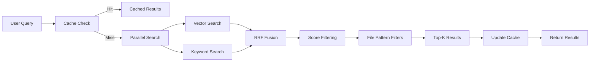

## Overview

th0th implements **hybrid semantic search** that combines the best of vector similarity and keyword matching. This approach achieves higher accuracy than either method alone by using Reciprocal Rank Fusion (RRF) to merge results.

<Info>
**98% token reduction** is achieved by returning only the most relevant code chunks instead of entire files, dramatically reducing context size for AI assistants.
</Info>

## How It Works

### Hybrid Retrieval Pipeline



<Steps>
  <Step title="Cache Lookup">
    Check L1 (memory) and L2 (SQLite) caches first. **50%+ cache hit rate** on typical workloads.
  </Step>
  <Step title="Parallel Retrieval">
    If cache miss, run vector and keyword searches **in parallel** for speed.
  </Step>
  <Step title="RRF Fusion">
    Combine results using Reciprocal Rank Fusion with intelligent boosting.
  </Step>
  <Step title="Filtering">
    Apply minimum score threshold and file pattern filters (include/exclude).
  </Step>
  <Step title="Caching">
    Store final results in both L1 and L2 caches with TTL of 1 hour.
  </Step>
</Steps>

## Vector Search

### Embedding Generation

Each code chunk is converted to a high-dimensional vector (embedding) that captures semantic meaning:

```typescript
// Example: Embedding a code chunk
const chunk = `
  async function authenticateUser(credentials) {
    const user = await db.findUser(credentials.email);
    return await bcrypt.compare(credentials.password, user.hash);
  }
`;

// Generate 768-dimensional embedding (Ollama nomic-embed-text)
const embedding = await embeddingService.embed(chunk);
// => [0.023, -0.145, 0.891, ...] (768 numbers)
```

<Accordion title="Supported Embedding Models">

| Provider | Model | Dimensions | Quality | Speed |
|----------|-------|------------|---------|-------|
| **Ollama** | nomic-embed-text | 768 | Good | Very Fast |
| **Ollama** | bge-m3 | 1024 | Great | Fast |
| **Mistral** | mistral-embed | 1024 | Great | Medium |
| **Mistral** | codestral-embed | 1024 | Excellent | Medium |
| **OpenAI** | text-embedding-3-small | 1536 | Excellent | Medium |

</Accordion>

### Similarity Calculation

Vector search finds chunks with embeddings **geometrically close** to the query embedding:

```typescript
// Cosine similarity: dot product of normalized vectors
function cosineSimilarity(a: number[], b: number[]): number {
  let dot = 0, normA = 0, normB = 0;
  for (let i = 0; i < a.length; i++) {
    dot += a[i] * b[i];
    normA += a[i] * a[i];
    normB += b[i] * b[i];
  }
  return dot / (Math.sqrt(normA) * Math.sqrt(normB));
}
```

<Tip>
Vector search excels at finding **semantically similar** code even when exact keywords don't match. For example, searching "hash password" will find `bcrypt.compare()` implementations.
</Tip>

## Keyword Search

### BM25 Scoring (FTS5)

th0th uses SQLite's **FTS5 (Full-Text Search 5)** with BM25 ranking:

```sql
-- Create FTS5 index with porter stemming
CREATE VIRTUAL TABLE keyword_search USING fts5(
  id UNINDEXED,
  content,
  metadata UNINDEXED,
  tokenize = 'porter unicode61'
);

-- Search with BM25 ranking
SELECT *, rank FROM keyword_search
WHERE content MATCH 'authenticateUser'
ORDER BY rank
LIMIT 10;
```

**BM25** (Best Matching 25) is a probabilistic ranking function that considers:
- **Term frequency**: How often the term appears in the document
- **Document length**: Shorter documents with matches rank higher
- **Inverse document frequency**: Rare terms are more valuable

<Note>
Keyword search is essential for finding **exact matches** like function names, class names, or specific identifiers that embeddings might miss.
</Note>

## Reciprocal Rank Fusion (RRF)

### The Algorithm

RRF combines rankings from multiple sources without needing to normalize scores:

```typescript
function reciprocalRankFusion(
  resultSets: SearchResult[][],
  k: number = 60  // RRF constant (empirically optimal)
): SearchResult[] {
  const scores = new Map<string, number>();
  
  // For each result set (vector, keyword)
  for (const results of resultSets) {
    results.forEach((result, rank) => {
      const rrfScore = 1 / (k + rank + 1);
      scores.set(
        result.id,
        (scores.get(result.id) || 0) + rrfScore
      );
    });
  }
  
  // Sort by combined RRF score
  return Array.from(scores.entries())
    .sort((a, b) => b[1] - a[1])
    .map(([id, score]) => ({ ...items.get(id), score }));
}
```

### Why RRF Works

<CardGroup cols={2}>
  <Card title="Score-Independent" icon="balance-scale">
    Works with incompatible scoring systems (cosine similarity vs BM25)
  </Card>
  <Card title="Rank-Based" icon="ranking-star">
    Focuses on relative ranking, not absolute scores
  </Card>
  <Card title="Empirically Proven" icon="chart-line">
    k=60 is optimal across diverse datasets (TREC research)
  </Card>
  <Card title="No Tuning Needed" icon="wand-magic-sparkles">
    Parameter-free for end users
  </Card>
</CardGroup>

### Intelligent Boosting

th0th applies **context-aware boosting** for code-specific queries:

```typescript
// Detect code patterns in query
const codePatterns = [
  /\w+\(\)/,          // function calls: useState(), render()
  /\bfunction\b/i,    // "function" keyword
  /\bclass\b/i,       // "class" keyword
  /\bimport\b/i,      // "import" keyword
];

const isCodeQuery = codePatterns.some(p => p.test(query));

// Boost keyword results for code queries (2.5x weight)
const KEYWORD_BOOST = isCodeQuery ? 2.5 : 1.0;
const rrfScore = (1 / (k + rank + 1)) * KEYWORD_BOOST;
```

<Accordion title="Example: Code Query Boosting">

**Query**: `cn() utility function`

**Without boosting**:
1. Vector: Documentation about utility functions (0.85)
2. Vector: Similar helper code (0.82)
3. Keyword: Exact `cn()` definition (0.75)

**With boosting** (2.5x for keyword):
1. **Keyword: Exact `cn()` definition (1.88)** ✨
2. Vector: Documentation about utility functions (0.85)
3. Vector: Similar helper code (0.82)

The exact function definition now ranks first!

</Accordion>

## Smart Chunking

### Language-Aware Splitting

th0th uses different chunking strategies based on file type:

<Tabs>
  <Tab title="Markdown">
    Split by **headings** with hierarchy context:
    
    ```markdown
    # Installation
    ## Prerequisites
    You need Node.js 18+
    
    ## Quick Start
    Run npm install
    ```
    
    **Chunks**:
    - `Installation > Prerequisites` (with heading context)
    - `Installation > Quick Start` (with heading context)
  </Tab>
  
  <Tab title="JSON">
    Split by **top-level keys**:
    
    ```json
    {
      "scripts": { "build": "tsc" },
      "dependencies": { "react": "^18.0.0" }
    }
    ```
    
    **Chunks**:
    - `{ "scripts": ... }`
    - `{ "dependencies": ... }`
  </Tab>
  
  <Tab title="Code">
    Split by **functions/classes** with preceding comments:
    
    ```typescript
    /**
     * Authenticate user credentials
     */
    async function authenticateUser(creds) {
      // implementation
    }
    ```
    
    **Chunk includes**: JSDoc + function signature + body
  </Tab>
  
  <Tab title="YAML">
    Split by **top-level keys** or document separators (`---`):
    
    ```yaml
    server:
      port: 3000
    database:
      host: localhost
    ```
    
    **Chunks**:
    - `server: ...`
    - `database: ...`
  </Tab>
</Tabs>

### Chunk Configuration

```typescript
interface ChunkerConfig {
  maxChunkLines: 200;      // Max lines per chunk
  minChunkLines: 5;        // Min lines (smaller merged)
  codeChunkTarget: 80;     // Target size for code blocks
  fixedChunkSize: 50;      // Fallback for unknown types
  addFileContext: true;    // Prepend file path to chunk
}
```

<Tip>
**Why chunk?** Large files (1000+ lines) would produce poor embeddings. Chunking creates focused, searchable units while preserving context.
</Tip>

## Multi-Level Caching

### Two-Level Architecture

```typescript
class SearchCache {
  private l1Cache: Map<string, CacheEntry>;  // In-memory
  private l2Db: Database;                    // SQLite
  
  private readonly L1_MAX_SIZE = 100;        // entries
  private readonly L2_MAX_SIZE = 10000;      // entries
  private readonly DEFAULT_TTL = 3600;       // 1 hour
}
```

<CardGroup cols={2}>
  <Card title="L1 Cache (Memory)" icon="bolt">
    **< 5ms** lookup time
    
    100 most recent queries
    
    LRU eviction
  </Card>
  <Card title="L2 Cache (SQLite)" icon="database">
    **< 20ms** lookup time
    
    10,000 queries max
    
    LRU eviction with indexes
  </Card>
</CardGroup>

### Cache Key Generation

Cache keys are **content-addressed** using SHA256:

```typescript
function generateCacheKey(
  query: string,
  projectId: string,
  options: { maxResults, include, exclude }
): string {
  const payload = JSON.stringify({
    query: query.toLowerCase().trim(),
    projectId,
    options: normalizeOptions(options)
  });
  return crypto.createHash('sha256').update(payload).digest('hex');
}
```

<Warning>
Only **search-affecting** parameters are included in the cache key. Presentation options like `explainScores` are ignored to maximize cache reuse.
</Warning>

### Cache Invalidation

<Accordion title="Full Project Invalidation">
Triggered after complete reindexing:

```typescript
await searchCache.invalidateProject(projectId);
// Removes all cached queries for this project
```
</Accordion>

<Accordion title="File-Based Invalidation">
More granular: only invalidate queries affected by changed files:

```typescript
const result = await searchCache.invalidateByFiles(
  projectId,
  ['src/auth.ts', 'src/utils.ts']
);

// Only queries with results from auth.ts or utils.ts are cleared
// Other queries remain cached!
```
</Accordion>

## Performance Metrics

### Search Latency

<Tabs>
  <Tab title="Cache Hit (L1)">
    **3-5ms**
    
    Memory lookup + JSON deserialization
    
    Fastest path
  </Tab>
  
  <Tab title="Cache Hit (L2)">
    **10-20ms**
    
    SQLite query + JSON deserialization
    
    Still very fast
  </Tab>
  
  <Tab title="Cache Miss">
    **50-200ms**
    
    Breakdown:
    - Embedding generation: 20-50ms
    - Vector search: 10-50ms
    - Keyword search: 5-20ms
    - RRF fusion: 5-10ms
    - Cache update: 5-10ms
  </Tab>
</Tabs>

### Cache Hit Rate

<Info>
Typical workloads achieve **50-70% cache hit rate** due to repeated queries during development sessions.
</Info>

Monitor cache performance:

```typescript
const stats = searchCache.getStats();
console.log(stats);
// {
//   l1Hits: 245,
//   l2Hits: 89,
//   totalHits: 334,
//   totalMisses: 166,
//   hitRate: 0.668  // 66.8%
// }
```

## Advanced Features

### File Pattern Filters

Include/exclude results by glob patterns:

```typescript
const results = await search('authentication', projectId, {
  includeFilters: ['src/**/*.ts'],     // Only TypeScript files
  excludeFilters: ['**/*.test.ts'],    // Exclude tests
  maxResults: 10
});
```

### Score Explanations

Debug ranking with detailed score breakdowns:

```typescript
const results = await search('cn utility', projectId, {
  explainScores: true
});

console.log(results[0].explanation);
// {
//   vectorScore: 0.82,
//   keywordScore: 0.95,
//   vectorRank: 3,
//   keywordRank: 1,
//   rrfScore: 0.0289,
//   finalScore: 0.92,
//   breakdown: "Vector: 82.0% (rank #3) + Keyword: 95.0% (rank #1) → RRF: 0.0289 → Final: 92.0%"
// }
```

### Warmup Queries

Pre-populate cache after indexing:

```typescript
await contextualSearch.warmupCache(projectId, projectPath, [
  'authentication',
  'api endpoints',
  'database models',
  'components',
  'error handling'
]);
// Runs background searches to warm L1/L2 caches
```

## Best Practices

<Card title="Query Writing" icon="pen">
  **Be specific**: Use function names, class names, or technical terms
  
  **Natural language works**: "how to hash passwords" finds relevant code
  
  **Avoid overly broad**: "utils" returns too many results
</Card>

<Card title="Index Maintenance" icon="screwdriver-wrench">
  **Regular reindexing**: Run after major code changes
  
  **Incremental updates**: th0th auto-detects stale indexes
  
  **Cache cleanup**: Runs automatically (1-hour TTL)
</Card>

<Card title="Performance Tuning" icon="gauge">
  **Adjust maxResults**: Lower = faster (default: 10)
  
  **Use file filters**: Narrow search scope for speed
  
  **Monitor cache stats**: Aim for 60%+ hit rate
</Card>

## Related Topics

<CardGroup cols={2}>
  <Card title="Architecture" icon="sitemap" href="/concepts/architecture">
    Overall system design and component interaction
  </Card>
  <Card title="Compression" icon="compress" href="/concepts/compression">
    Reduce token usage with intelligent compression
  </Card>
  <Card title="Memory" icon="brain" href="/concepts/memory">
    Long-term memory and pattern recognition
  </Card>
  <Card title="API Reference" icon="code" href="/api/endpoints">
    Complete search API documentation
  </Card>
</CardGroup>